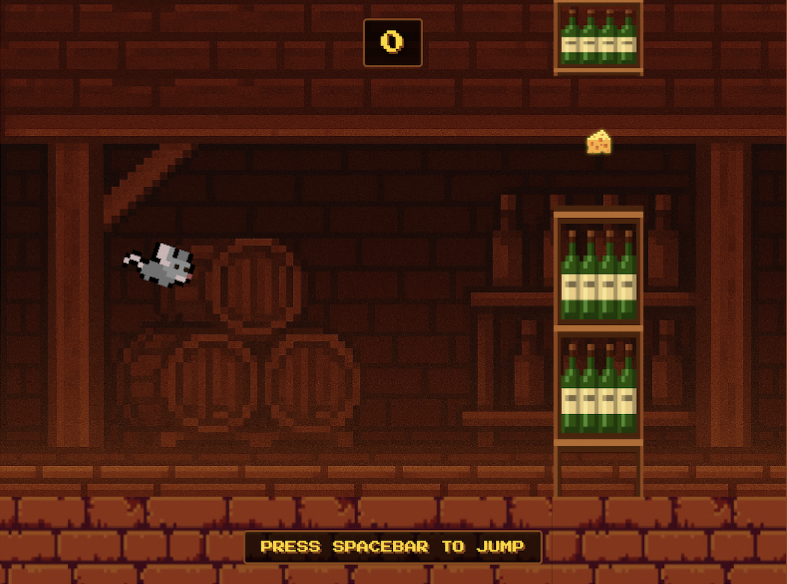

# 🧀 CheesyMouse - Wine Cellar Adventure

Navigate a brave mouse through a treacherous wine cellar, collecting cheese while avoiding deadly wine bottle shelves.

This is a fun little project where I tested something I've never done before (game design) by vibe-coding it with Cursor. Just wanted to see what would happen if I tried to build a simple "Flappy Bird clone" from scratch.

## 🎮 How to Play

- **SPACEBAR or CLICK** to jump
- **Collect cheese** to increase your score
- **Avoid wine shelves** - they're deadly!
- **Survive as long as possible** and beat your high score

## ✨ Features

- **Pixel Art Style** - Beautiful retro graphics
- **Progressive Difficulty** - Game speeds up and gaps get smaller as you progress 
- **High Score System** - Beat your personal best

## 🚀 Play Online

**Live Demo:** [Play CheesyMouse Now!](https://Nek-11.github.io/CheesyMouse/)

## 🛠️ Local

1. Clone the repository
2. Open `index.html` in your browser
3. Start playing!

No build process required: it's pure HTML5/JavaScript.

## 📁 Game Assets

- `images` - Background, mouse frames, wine shelves...
- `sounds` - Mouse jumping, eating and dying

## 🎯 Made with

- **HTML5 Canvas** for rendering
- **Pure JavaScript** for game logic
- **CSS3** for UI styling
- **ChatGPT** for image creation
- **Royalty free images and sounds** found online
- **Cursor** for coding

---

**Created with  🧀**